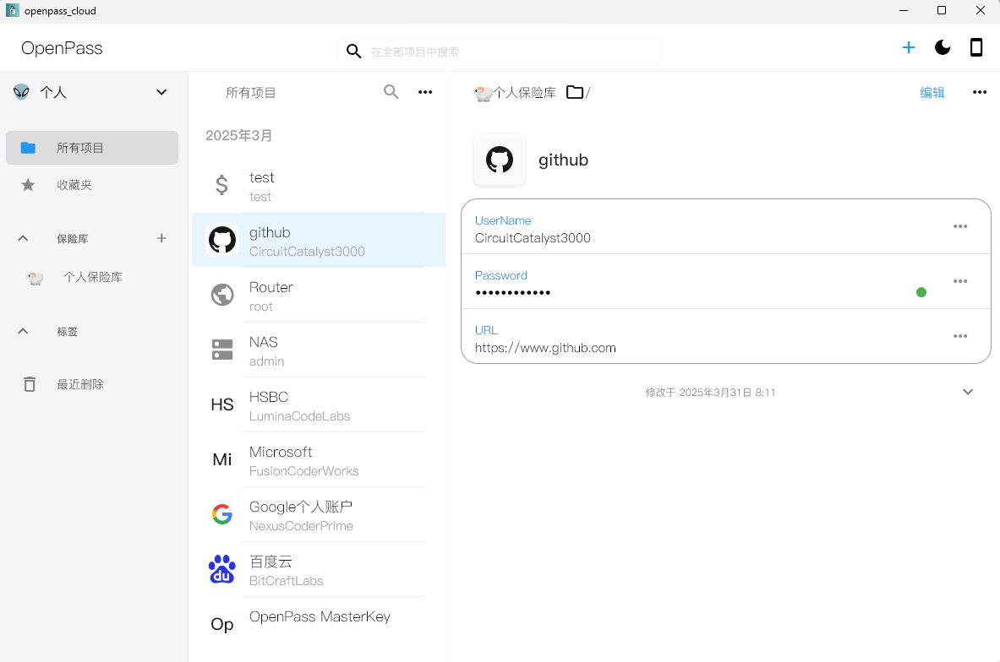
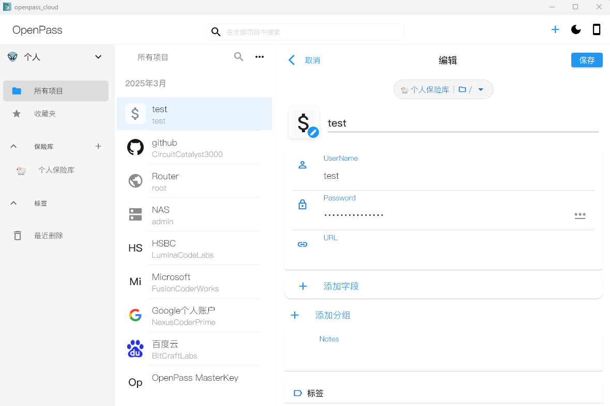

# Openpass

## Getting Started

*A Flutter-based password manager with 80%+ AI-generated code (core features created by AI and manually optimized).*

### Features

- Uses KeePass file format storage with equivalent security
- Local storage of access history secured by master password

### Core Features

OpenPass provides a comprehensive password management solution, with main features including:

#### 1. Secure Storage

- KeePass file format with military-grade encryption
- AES-256 encryption for all sensitive data
- Two-factor authentication (master password + key file)

#### 2. Password Management

- Supports multiple types of password entries: websites, applications, bank cards, etc
- Folder classification management, supporting multi-level nesting
- Powerful password generator with customizable complexity rules

#### 3. Biometric identification

- Support quick unlocking of Face ID/Touch ID
- Device fingerprint verification to prevent unauthorized access
- Automatic locking mechanism to protect privacy and security (Not yet)

#### 4. Cross platform synchronization (Not yet)

- Synchronize local file storage with cloud storage (Not yet)
- Support connection to private clouds using the WebDAV protocol (Not yet)
- Conflict detection and merging function (Not yet)

#### 5. Advanced security features

- Password Health Check and Security Rating (Not yet)
- Data leakage monitoring (Not yet)

#### 6.  user experience Optimization

- Intelligent automatic filling function (Not yet)
- Global Quick Search
- Multi theme support and custom interface (Not yet)
- Responsive design adapts to various devices

### Reference Resources

- [kpasslib: keepass的flutter库](https://pub-web.flutter-io.cn/packages/kpasslib)

---

## 概述

这是一个基于Flutter开发的密码管理项目，，80%以上的代码由AI辅助开发完成，主要功能代码由AI生成并经过人工审核优化。

## 示例图

### 项目特点

- 使用keepass文件做存储，所以安全性基本等同于keepass
- 便捷访问或者访问历史使用主密码保存在本地

### 核心功能

Openpass提供全面的密码管理解决方案，主要功能包括：

#### 1. 安全存储

- 采用KeePass文件格式存储，确保数据安全
- AES-256加密算法保护所有敏感数据
- 支持主密码+密钥文件双重认证

#### 2. 密码管理

- 支持多种密码条目类型：网站、应用、银行卡等
- 文件夹分类管理，支持多级嵌套
- 强大的密码生成器，可自定义复杂度规则

#### 3. 生物识别

- 支持Face ID/Touch ID快速解锁
- 设备指纹验证，防止未授权访问
- 自动锁定机制，保护隐私安全 (未完成)

#### 4. 跨平台同步 (未完成)

- 本地文件存储与云存储同步 (未完成)
- 支持WebDAV协议连接私有云 (未完成)
- 冲突检测与合并功能 (未完成)

#### 5. 高级安全功能

- 密码健康检查与安全评分 (未完成)
- 数据泄露监控 (未完成)

#### 6. 用户体验优化

- 智能自动填充功能 (未完成)
- 全局快速搜索
- 多主题支持与自定义界面 (未完成)
- 响应式设计适配各种设备

### 参考资源

- [kpasslib: keepass的flutter库](https://pub-web.flutter-io.cn/packages/kpasslib)
