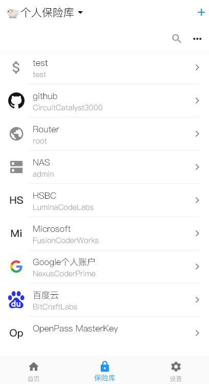

# Openpass

## Getting Started

这是一个基于Flutter开发的密码管理项目，，80%以上的代码由AI辅助开发完成，主要功能代码由AI生成并经过人工审核优化。

## 示例图

### 项目特点

- 使用keepass文件做存储，所以安全性基本等同于keepass
- 便捷访问或者访问历史使用主密码保存在本地

### 核心功能

Openpass提供全面的密码管理解决方案，主要功能包括：

#### 1. 安全存储

- 采用KeePass文件格式存储，确保数据安全
- AES-256加密算法保护所有敏感数据
- 支持主密码+密钥文件双重认证

#### 2. 密码管理

- 支持多种密码条目类型：网站、应用、银行卡等
- 文件夹分类管理，支持多级嵌套
- 强大的密码生成器，可自定义复杂度规则

#### 3. 生物识别

- 支持Face ID/Touch ID快速解锁
- 设备指纹验证，防止未授权访问
- 自动锁定机制，保护隐私安全

#### 4. 跨平台同步

- 本地文件存储与云存储同步
- 支持WebDAV协议连接私有云
- 冲突检测与合并功能

#### 5. 高级安全功能

- 密码健康检查与安全评分
- 数据泄露监控
- 紧急访问与安全共享机制
- 完整的审计日志记录

#### 6. 用户体验优化

- 智能自动填充功能
- 全局快速搜索
- 多主题支持与自定义界面
- 响应式设计适配各种设备

### 参考资源

- [kpasslib: keepass的flutter库](https://pub-web.flutter-io.cn/packages/kpasslib)
